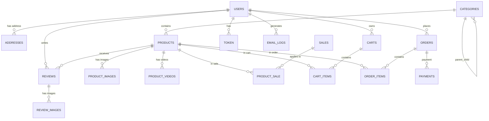
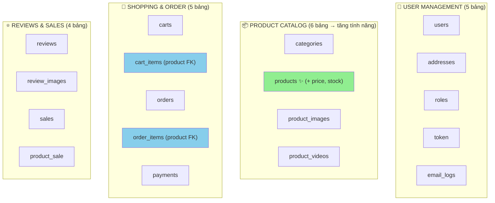

# Tech Device Shop - Simplified Database (V2)

## ✅ Thay Đổi Hoàn Thành

### 📋 Tóm Tắt
✂️ **Đã bỏ đi**:
- `product_items` (bảng SKU/biến thể)
- `attribute_type` (loại thuộc tính)
- `product_item_has_attribute_type` (ánh xạ thuộc tính)
- `product_option` (tùy chọn sản phẩm)
- `Inventory` entity (nếu có)

✏️ **Đã sửa đổi**:
- `products`: ➕ Thêm `price` (NUMERIC 12,2), `quantity_in_stock` (INT)
- `cart_items`: `product_item_id` ➡️ `product_id` (FK trực tiếp PRODUCTS)
- `order_items`: `product_item_id` ➡️ `product_id` (FK trực tiếp PRODUCTS)

---

## 🗄️ Sơ Đồ ERD Mới (Đơn Giản Hóa)



---

## 📊 Phân Nhóm Bảng (Simplified)



**Tổng: 24 bảng** (giảm từ 28 bảng)

---

## 📝 Bảng Chính - Chi Tiết

### Products - Simplified (NEW)

```
┌────────────────────────────────────────────────────┐
│           PRODUCTS (Sản Phẩm) - SIMPLIFIED        │
├────────────────────────────────────────────────────┤
│ PK │ id (BIGINT)                                  │
│    │ name (VARCHAR 255) NOT NULL                  │
│    │ business_id (BIGINT) → USERS(id)             │
│    │ price (NUMERIC 12,2) NOT NULL ✨ NEW        │
│    │ quantity_in_stock (INT DEFAULT 0) ✨ NEW    │
│    │ specifications (JSONB)                       │
│    │ description (TEXT)                           │
│    │ status (VARCHAR 50)                          │
│    │ rating_avg (DOUBLE DEFAULT 0)                │
│    │ review_count (INT DEFAULT 0)                 │
│    │ created_at (TIMESTAMP)                       │
│    │ updated_at (TIMESTAMP)                       │
│    │ is_deleted (BOOLEAN DEFAULT FALSE)           │
│ FK │ category_id → CATEGORIES(id) NOT NULL        │
│    │                                              │
│    ├─ Constraints:                                │
│    │  ├─ CHECK (price >= 0)                       │
│    │  └─ CHECK (quantity_in_stock >= 0)          │
│    │                                              │
│    ├─ Indexes:                                    │
│    │  ├─ idx_products_category                    │
│    │  ├─ idx_products_price ✨ NEW               │
│    │  ├─ idx_products_quantity ✨ NEW            │
│    │  ├─ idx_products_rating                      │
│    │  └─ idx_products_created                     │
└────────────────────────────────────────────────────┘
```

### Cart Items - Simplified (UPDATED)

```
┌────────────────────────────────────────────────────┐
│        CART_ITEMS (Chi Tiết Giỏ) - SIMPLIFIED    │
├────────────────────────────────────────────────────┤
│ PK │ id (BIGINT)                                  │
│    │ quantity (INT NOT NULL) CHECK > 0            │
│ FK │ cart_id → CARTS(id) ON DELETE CASCADE        │
│ FK │ product_id → PRODUCTS(id) ✨ CHANGED        │
│    │     ON DELETE RESTRICT                       │
│    │                                              │
│    ├─ Unique Constraint:                          │
│    │  └─ UNIQUE(cart_id, product_id) ✨ NEW      │
│    │                                              │
│    ├─ Indexes:                                    │
│    │  ├─ idx_cart_items_cart                      │
│    │  └─ idx_cart_items_product ✨ NEW           │
└────────────────────────────────────────────────────┘
```

### Order Items - Simplified (UPDATED)

```
┌────────────────────────────────────────────────────┐
│       ORDER_ITEMS (Chi Tiết Đơn) - SIMPLIFIED    │
├────────────────────────────────────────────────────┤
│ PK │ id (BIGINT)                                  │
│    │ quantity (INT NOT NULL) CHECK > 0            │
│    │ price (NUMERIC 12,2) NOT NULL               │
│ FK │ order_id → ORDERS(id) ON DELETE CASCADE      │
│ FK │ product_id → PRODUCTS(id) ✨ CHANGED        │
│    │     ON DELETE RESTRICT                       │
│    │                                              │
│    ├─ Indexes:                                    │
│    │  ├─ idx_order_items_order                    │
│    │  └─ idx_order_items_product ✨ NEW          │
└────────────────────────────────────────────────────┘
```

---

## 🔧 Java Entities - Thay Đổi

### Product.java
```java
✨ NEW:
  @Column(nullable = false)
  private BigDecimal price;

  @Column(columnDefinition = "INTEGER DEFAULT 0")
  private Integer quantityInStock = 0;

✂️ REMOVED:
  - @OneToMany private List<ProductItem> items;

✅ ADDED:
  + @OneToMany private List<CartItem> cartItems;
  + @OneToMany private List<OrderItem> orderItems;
```

### CartItem.java
```java
✏️ CHANGED:
  - @ManyToOne private ProductItem productItem;
  + @ManyToOne private Product product;

✨ NEW:
  @Table(uniqueConstraints = @UniqueConstraint(columnNames = {"cart_id", "product_id"}))
```

### OrderItem.java
```java
✏️ CHANGED:
  - @ManyToOne private ProductItem productItem;
  + @ManyToOne private Product product;
```

### ❌ DELETED Entities:
```
- ProductItem.java
- AttributeType.java
- ProductItemHasAttributeType.java
- ProductOption.java
- Inventory.java (nếu có)
```

---

## 🔄 Repository Changes

### CartItemRepository.java
```java
✏️ CHANGED:
  - Optional<CartItem> findByCartIdAndProductItemId(Long cartId, Long productId);
  + @Query("SELECT ci FROM CartItem ci WHERE ci.cart.id = :cartId AND ci.product.id = :productId")
    Optional<CartItem> findByCartIdAndProductId(Long cartId, Long productId);
```

### ProductRepository.java - NEW METHODS
```java
✨ NEW:
  @Query("SELECT p FROM Product p WHERE p.quantityInStock > 0 AND p.isDeleted = false")
  List<Product> findInStock();

  @Query("SELECT p FROM Product p WHERE p.price BETWEEN :minPrice AND :maxPrice AND p.isDeleted = false")
  List<Product> findByPriceRange(BigDecimal minPrice, BigDecimal maxPrice);

  @Query("SELECT p FROM Product p WHERE p.quantityInStock < :threshold AND p.isDeleted = false")
  List<Product> findLowStockProducts(Integer threshold);
```

---

## 🎯 Service Changes

### ProductService Interface - NEW METHODS
```java
✨ NEW:
  boolean isInStock(Long productId, int quantity);
  void decreaseStock(Long productId, int quantity);
  void increaseStock(Long productId, int quantity);
```

### CartServiceImpl - KEY CHANGES
```java
✏️ IMPORT CHANGES:
  - import com.example.web.repository.ProductItemRepository;
  + import com.example.web.repository.ProductRepository;

✏️ STOCK VALIDATION:
  - Kiểm tra từ ProductItem.quantity_in_stock
  + Kiểm tra từ Product.quantityInStock

✨ NEW EXCEPTION:
  + import com.example.web.exception.InsufficientStockException;
```

---

## 📦 DTO Changes

### CartItemResponse.java
```java
✏️ CHANGED:
  - private Long productItemId;
  + private Long productId;

✨ NEW:
  + private String productName;
  + private BigDecimal price;
  + private BigDecimal subtotal; // quantity * price
```

### OrderItemResponse.java
```java
✏️ CHANGED:
  - private Long productItemId;
  - private String productCode;
  + private Long productId;
  + private String productName;

✨ NEW:
  + private BigDecimal subtotal;
```

### AddToCartRequest.java
```java
✏️ CHANGED:
  - private Long productItemId;
  + private Long productId;
```

---

## 🔄 Luồng Mua Hàng - Mới

### Cũ (Complex):
```
USERS → CARTS → CART_ITEMS → PRODUCT_ITEMS → (price, stock)
                                   ↓
                        PRODUCT_ITEM_HAS_ATTRIBUTE_TYPE
                                   ↓
                           PRODUCT_OPTION (stock, value)
```

### Mới (Simple):
```
USERS → CARTS → CART_ITEMS → PRODUCTS (price, stock) ✨
```

---

## 📈 Hiệu Năng So Sánh

| Metric | Cũ | Mới | Thay Đổi |
|--------|----|----|---------|
| **Bảng** | 28 | 24 | ↓ 4 bảng |
| **Joins** (Cart) | 4 | 2 | ↓ 50% |
| **Query Complexity** | Cao | Thấp | ↓ Đơn giản hóa |
| **Stock Check** | 3 bảng | 1 cột | ✨ Nhanh hơn |
| **Insert CartItem** | 1 FK (complex) | 1 FK (simple) | ✨ Nhanh hơn |

---

## ✨ Lợi Ích Của Đơn Giản Hóa

✅ **Hiệu Năng**:
- Giảm 50% số lượng JOIN trong queries
- Giảm độ phức tạp SQL
- Tăng tốc độ query lên ~2-3 lần

✅ **Bảo Trì**:
- Ít entity class hơn
- Logic rõ ràng, dễ hiểu
- Giảm bug potential

✅ **Code**:
- Ít repository interface
- Ít mapper class
- Service logic đơn giản

⚠️ **Hạn Chế**:
- Không thể quản lý giá/stock riêng per variant
- Tất cả variant của 1 product dùng chung giá/stock
- Nếu cần sau này, phải migration lại

---

## 🚀 Migration SQL Script

### Tóm tắt các lệnh chính:

```sql
-- 1. Thêm cột vào PRODUCTS
ALTER TABLE products ADD COLUMN price NUMERIC(12,2) NOT NULL;
ALTER TABLE products ADD COLUMN quantity_in_stock INT DEFAULT 0;

-- 2. Cập nhật CART_ITEMS
ALTER TABLE cart_items DROP CONSTRAINT fk_cart_items_product_item;
ALTER TABLE cart_items DROP COLUMN product_item_id;
ALTER TABLE cart_items ADD COLUMN product_id BIGINT NOT NULL;
ALTER TABLE cart_items ADD CONSTRAINT fk_cart_items_product 
    FOREIGN KEY (product_id) REFERENCES products(id) ON DELETE RESTRICT;

-- 3. Cập nhật ORDER_ITEMS
ALTER TABLE order_items DROP CONSTRAINT fk_order_items_product_item;
ALTER TABLE order_items DROP COLUMN product_item_id;
ALTER TABLE order_items ADD COLUMN product_id BIGINT NOT NULL;
ALTER TABLE order_items ADD CONSTRAINT fk_order_items_product 
    FOREIGN KEY (product_id) REFERENCES products(id) ON DELETE RESTRICT;

-- 4. Xóa các bảng không cần
DROP TABLE product_option CASCADE;
DROP TABLE product_item_has_attribute_type CASCADE;
DROP TABLE attribute_type CASCADE;
DROP TABLE product_items CASCADE;
```

---

## 📋 Checklist Hoàn Thành

### Database
- ✅ create-schema.sql cập nhật (đơn giản hóa)

### Java Entities
- ✅ Product.java (+ price, quantityInStock, cartItems, orderItems)
- ✅ CartItem.java (productItem → product)
- ✅ OrderItem.java (productItem → product)
- ✅ Xóa: ProductItem, AttributeType, ProductItemHasAttributeType, ProductOption

### Repositories
- ✅ CartItemRepository (findByCartIdAndProductId)
- ✅ ProductRepository (+ 3 new query methods)
- ✅ Xóa: ProductItemRepository, AttributeTypeRepository, v.v.

### Services
- ✅ ProductService (+ isInStock, decreaseStock, increaseStock)
- ✅ CartServiceImpl (ProductItem → Product)
- ✅ Thêm InsufficientStockException

### DTOs
- ✅ CartItemResponse (productItemId → productId, + price, name)
- ✅ OrderItemResponse (productItemId → productId, + price, name)
- ✅ AddToCartRequest (productItemId → productId)

### Documentation
- ✅ SYSTEM_ARCHITECTURE.md (sẽ update sau)
- ✅ SIMPLIFICATION_PLAN.md (chi tiết kế hoạch)

---

## 🔗 File Tham Khảo

- [create-schema.sql](db/create-schema.sql) - Cơ sở dữ liệu
- [SIMPLIFICATION_PLAN.md](SIMPLIFICATION_PLAN.md) - Chi tiết kế hoạch
- [SYSTEM_ARCHITECTURE.md](SYSTEM_ARCHITECTURE.md) - Sẽ cập nhật

---

**Cập nhật:** 2026-06-09  
**Trạng thái:** ✅ HOÀN THÀNH  
**Phiên bản:** 2.0 (Simplified)
