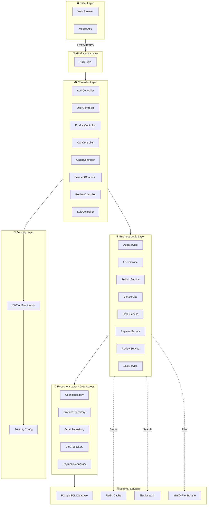
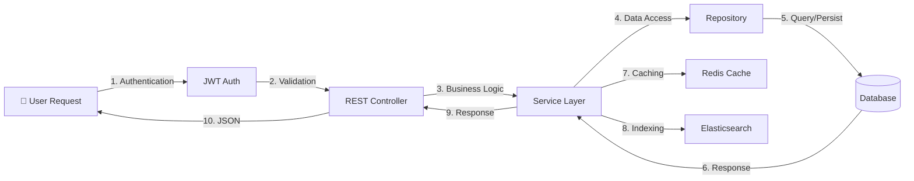
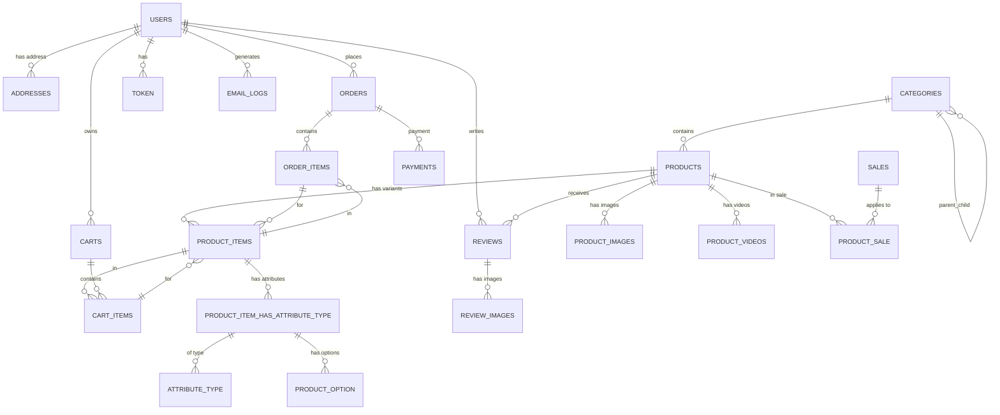
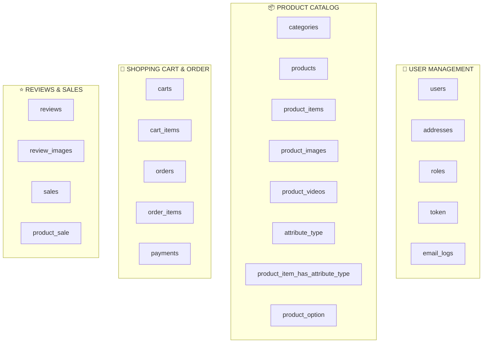

# Tech Device Shop - System Architecture & Database Diagram

## 📋 Mục lục
1. [Tổng Quan Hệ Thống](#tổng-quan-hệ-thống)
2. [Kiến Trúc Hệ Thống](#kiến-trúc-hệ-thống)
3. [Sơ Đồ Cơ Sở Dữ Liệu](#sơ-đồ-cơ-sở-dữ-liệu)
4. [Chi Tiết Các Bảng](#chi-tiết-các-bảng)
5. [Công Nghệ Sử Dụng](#công-nghệ-sử-dụng)

---

## 🏗️ Tổng Quan Hệ Thống

**Tech Device Shop** là một nền tảng thương mại điện tử chuyên bán thiết bị công nghệ. Hệ thống được xây dựng với:
- **Backend Framework**: Spring Boot 3.2.5
- **Java Version**: 21
- **Database**: PostgreSQL/MySQL
- **Caching**: Redis
- **Search Engine**: Elasticsearch
- **File Storage**: MinIO
- **Authentication**: JWT (JSON Web Token)
- **Containerization**: Docker & Docker Compose

---

## 🏢 Kiến Trúc Hệ Thống

### Tổng Quan Kiến Trúc



### Luồng Xử Lý Chính



---

## 🗄️ Sơ Đồ Cơ Sở Dữ Liệu

### ERD - Entity Relationship Diagram



### Phân Nhóm Bảng Chính



---

## 📊 Chi Tiết Các Bảng

### 1. USER MANAGEMENT (Quản Lý Người Dùng)

#### **USERS** - Người dùng hệ thống
```
┌─────────────────────────────────────────────┐
│              USERS (Người Dùng)              │
├─────────────────────────────────────────────┤
│ PK │ id (BIGINT)                            │
│    │ email (VARCHAR 255) - UNIQUE, INDEX    │
│    │ password_hash (VARCHAR 255)            │
│    │ full_name (VARCHAR 255)                │
│    │ phone (VARCHAR 20)                     │
│    │ role (VARCHAR 50) - INDEX              │
│    │ created_at (TIMESTAMP)                 │
│    │ is_deleted (BOOLEAN)                   │
│ FK │ address_id → ADDRESSES(id)             │
└─────────────────────────────────────────────┘
```

#### **ADDRESSES** - Địa chỉ giao hàng
```
┌─────────────────────────────────────────────┐
│           ADDRESSES (Địa Chỉ)                │
├─────────────────────────────────────────────┤
│ PK │ id (BIGINT)                            │
│    │ receiver_name (VARCHAR 255)            │
│    │ phone (VARCHAR 20)                     │
│    │ province (VARCHAR 100)                 │
│    │ district (VARCHAR 100)                 │
│    │ ward (VARCHAR 100)                     │
│    │ detail (VARCHAR 255)                   │
└─────────────────────────────────────────────┘
```

#### **TOKEN** - Lưu trữ JWT Token
```
┌─────────────────────────────────────────────┐
│           TOKEN (JWT Tokens)                 │
├─────────────────────────────────────────────┤
│ PK │ id (BIGINT)                            │
│    │ access_token (TEXT)                    │
│    │ refresh_token (TEXT)                   │
│ FK │ user_id → USERS(id) - UNIQUE          │
└─────────────────────────────────────────────┘
```

#### **EMAIL_LOGS** - Lịch sử email
```
┌─────────────────────────────────────────────┐
│         EMAIL_LOGS (Lịch Sử Email)          │
├─────────────────────────────────────────────┤
│ PK │ id (BIGINT)                            │
│    │ email (VARCHAR 255)                    │
│    │ subject (VARCHAR 255)                  │
│    │ status (VARCHAR 50)                    │
│    │ sent_at (TIMESTAMP)                    │
│ FK │ user_id → USERS(id)                    │
└─────────────────────────────────────────────┘
```

---

### 2. PRODUCT CATALOG (Danh Mục Sản Phẩm)

#### **CATEGORIES** - Danh mục sản phẩm
```
┌─────────────────────────────────────────────┐
│        CATEGORIES (Danh Mục)                 │
├─────────────────────────────────────────────┤
│ PK │ id (BIGINT)                            │
│    │ name (VARCHAR 255)                     │
│    │ slug (VARCHAR 255) - UNIQUE, INDEX     │
│    │ parent_id (BIGINT) - FK (Self), INDEX  │
│    │ is_deleted (BOOLEAN)                   │
└─────────────────────────────────────────────┘
```

#### **PRODUCTS** - Sản phẩm
```
┌──────────────────────────────────────────────────────┐
│           PRODUCTS (Sản Phẩm)                        │
├──────────────────────────────────────────────────────┤
│ PK │ id (BIGINT)                                    │
│    │ name (VARCHAR 255)                            │
│    │ specifications (JSONB)                        │
│    │ description (TEXT)                            │
│    │ status (VARCHAR 50)                           │
│    │ rating_avg (DOUBLE) - DEFAULT 0               │
│    │ review_count (INT) - DEFAULT 0                │
│    │ created_at (TIMESTAMP), INDEX DESC            │
│    │ updated_at (TIMESTAMP)                        │
│    │ is_deleted (BOOLEAN)                          │
│ FK │ category_id → CATEGORIES(id), INDEX           │
│ FK │ business_id → USERS(id), INDEX                │
└──────────────────────────────────────────────────────┘
```

#### **PRODUCT_ITEMS** - Biến thể sản phẩm (SKU)
```
┌─────────────────────────────────────────────┐
│      PRODUCT_ITEMS (Biến Thể Sản Phẩm)      │
├─────────────────────────────────────────────┤
│ PK │ id (BIGINT)                            │
│    │ product_code (VARCHAR 100) - UNIQUE    │
│    │ original_price (NUMERIC 12,2)          │
│ FK │ product_id → PRODUCTS(id), INDEX       │
│    │      ON DELETE: CASCADE                │
└─────────────────────────────────────────────┘
```

#### **PRODUCT_IMAGES** - Hình ảnh sản phẩm
```
┌──────────────────────────────────────────────┐
│      PRODUCT_IMAGES (Hình Ảnh Sản Phẩm)     │
├──────────────────────────────────────────────┤
│ PK │ id (BIGINT)                            │
│    │ image_url (TEXT)                       │
│    │ is_main (BOOLEAN)                      │
│ FK │ product_id → PRODUCTS(id), INDEX       │
│    │      ON DELETE: CASCADE                │
└──────────────────────────────────────────────┘
```

#### **PRODUCT_VIDEOS** - Video sản phẩm
```
┌──────────────────────────────────────────────┐
│       PRODUCT_VIDEOS (Video Sản Phẩm)        │
├──────────────────────────────────────────────┤
│ PK │ id (BIGINT)                            │
│    │ video_url (TEXT)                       │
│    │ is_main (BOOLEAN)                      │
│ FK │ product_id → PRODUCTS(id)              │
│    │      ON DELETE: CASCADE                │
└──────────────────────────────────────────────┘
```

#### **ATTRIBUTE_TYPE** - Loại thuộc tính
```
┌─────────────────────────────────────────────┐
│      ATTRIBUTE_TYPE (Loại Thuộc Tính)       │
├─────────────────────────────────────────────┤
│ PK │ id (BIGINT)                            │
│    │ name (VARCHAR 100)                     │
└─────────────────────────────────────────────┘
```

#### **PRODUCT_ITEM_HAS_ATTRIBUTE_TYPE** - Ánh xạ thuộc tính
```
┌──────────────────────────────────────────────────┐
│   PRODUCT_ITEM_HAS_ATTRIBUTE_TYPE (Ánh Xạ)     │
├──────────────────────────────────────────────────┤
│ PK │ id (BIGINT)                               │
│ FK │ product_item_id → PRODUCT_ITEMS(id)       │
│ FK │ attribute_type_id → ATTRIBUTE_TYPE(id)    │
│    │ UNIQUE(product_item_id, attribute_type_id)│
└──────────────────────────────────────────────────┘
```

#### **PRODUCT_OPTION** - Tùy chọn sản phẩm
```
┌──────────────────────────────────────────────────┐
│      PRODUCT_OPTION (Tùy Chọn Sản Phẩm)         │
├──────────────────────────────────────────────────┤
│ PK │ id (BIGINT)                               │
│    │ value_option (VARCHAR 100)                │
│    │ quantity_in_stock (INT)                   │
│ FK │ product_item_has_attribute_type_id        │
│    │     → PRODUCT_ITEM_HAS_ATTRIBUTE_TYPE(id) │
│    │ UNIQUE(attr_id, value_option)             │
└──────────────────────────────────────────────────┘
```

---

### 3. SHOPPING & ORDERS (Mua Sắm & Đơn Hàng)

#### **CARTS** - Giỏ hàng
```
┌──────────────────────────────────────────────┐
│          CARTS (Giỏ Hàng)                     │
├──────────────────────────────────────────────┤
│ PK │ id (BIGINT)                             │
│    │ created_at (TIMESTAMP)                  │
│ FK │ user_id → USERS(id) - UNIQUE            │
│    │      ON DELETE: CASCADE                 │
└──────────────────────────────────────────────┘
```

#### **CART_ITEMS** - Chi tiết giỏ hàng
```
┌──────────────────────────────────────────────┐
│       CART_ITEMS (Chi Tiết Giỏ Hàng)         │
├──────────────────────────────────────────────┤
│ PK │ id (BIGINT)                             │
│    │ quantity (INT) - CHECK > 0              │
│ FK │ cart_id → CARTS(id), INDEX              │
│    │      ON DELETE: CASCADE                 │
│ FK │ product_item_id → PRODUCT_ITEMS(id)    │
│    │      ON DELETE: RESTRICT                │
└──────────────────────────────────────────────┘
```

#### **ORDERS** - Đơn hàng
```
┌──────────────────────────────────────────────┐
│         ORDERS (Đơn Hàng)                     │
├──────────────────────────────────────────────┤
│ PK │ id (BIGINT)                             │
│    │ total_price (NUMERIC 12,2)              │
│    │ status (VARCHAR 50)                     │
│    │ payment_method (VARCHAR 50)             │
│    │ created_at (TIMESTAMP), INDEX DESC      │
│ FK │ user_id → USERS(id), INDEX              │
│ FK │ address_id → ADDRESSES(id)              │
└──────────────────────────────────────────────┘
```

#### **ORDER_ITEMS** - Chi tiết đơn hàng
```
┌──────────────────────────────────────────────┐
│       ORDER_ITEMS (Chi Tiết Đơn Hàng)        │
├──────────────────────────────────────────────┤
│ PK │ id (BIGINT)                             │
│    │ quantity (INT) - CHECK > 0              │
│    │ price (NUMERIC 12,2)                    │
│ FK │ order_id → ORDERS(id), INDEX            │
│    │      ON DELETE: CASCADE                 │
│ FK │ product_item_id → PRODUCT_ITEMS(id)    │
│    │      ON DELETE: RESTRICT                │
└──────────────────────────────────────────────┘
```

#### **PAYMENTS** - Thanh toán
```
┌──────────────────────────────────────────────┐
│         PAYMENTS (Thanh Toán)                 │
├──────────────────────────────────────────────┤
│ PK │ id (BIGINT)                             │
│    │ provider (VARCHAR 100)                  │
│    │ transaction_id (VARCHAR 255)            │
│    │ amount (NUMERIC 12,2)                   │
│    │ status (VARCHAR 50)                     │
│    │ created_at (TIMESTAMP)                  │
│ FK │ order_id → ORDERS(id) - UNIQUE          │
│    │      ON DELETE: CASCADE                 │
└──────────────────────────────────────────────┘
```

---

### 4. REVIEWS & SALES (Đánh Giá & Khuyến Mãi)

#### **REVIEWS** - Đánh giá sản phẩm
```
┌───────────────────────────────────────────────┐
│        REVIEWS (Đánh Giá Sản Phẩm)            │
├───────────────────────────────────────────────┤
│ PK │ id (BIGINT)                             │
│    │ rating (INT) - CHECK 1-5                │
│    │ comment (TEXT)                          │
│    │ created_at (TIMESTAMP)                  │
│    │ updated_at (TIMESTAMP)                  │
│ FK │ product_id → PRODUCTS(id), INDEX        │
│    │      ON DELETE: CASCADE                 │
│ FK │ user_id → USERS(id)                    │
│    │      ON DELETE: SET NULL                │
│    │ UNIQUE(user_id, product_id)             │
└───────────────────────────────────────────────┘
```

#### **REVIEW_IMAGES** - Hình ảnh đánh giá
```
┌───────────────────────────────────────────────┐
│       REVIEW_IMAGES (Hình Ảnh Đánh Giá)      │
├───────────────────────────────────────────────┤
│ PK │ id (BIGINT)                             │
│    │ image_url (TEXT)                        │
│ FK │ review_id → REVIEWS(id)                 │
│    │      ON DELETE: CASCADE                 │
└───────────────────────────────────────────────┘
```

#### **SALES** - Khuyến mãi
```
┌──────────────────────────────────────────────┐
│        SALES (Khuyến Mãi)                     │
├──────────────────────────────────────────────┤
│ PK │ id (BIGINT)                             │
│    │ code (VARCHAR 100)                      │
└──────────────────────────────────────────────┘
```

#### **PRODUCT_SALE** - Sản phẩm trong khuyến mãi
```
┌──────────────────────────────────────────────┐
│     PRODUCT_SALE (Sản Phẩm Khuyến Mãi)       │
├──────────────────────────────────────────────┤
│ PK │ id (BIGINT)                             │
│    │ value (INT) - Phần trăm giảm            │
│    │ isActive (BOOLEAN)                      │
│ FK │ product_id → PRODUCTS(id), INDEX        │
│    │      ON DELETE: CASCADE                 │
│ FK │ sale_id → SALES(id)                     │
│    │      ON DELETE: CASCADE                 │
└──────────────────────────────────────────────┘
```

---

## 🔑 Mối Quan Hệ Cơ Sở Dữ Liệu

### Luồng Mua Hàng

```
USERS
  ├─→ ADDRESSES (giao hàng)
  │
  ├─→ CARTS (giỏ hàng)
  │    └─→ CART_ITEMS
  │         └─→ PRODUCT_ITEMS (sản phẩm chọn)
  │
  ├─→ ORDERS (đơn hàng)
  │    ├─→ ORDER_ITEMS (chi tiết)
  │    │    └─→ PRODUCT_ITEMS
  │    │
  │    ├─→ ADDRESSES (giao tới)
  │    │
  │    └─→ PAYMENTS (thanh toán)
  │
  └─→ REVIEWS (đánh giá)
       ├─→ PRODUCTS (sản phẩm đánh giá)
       └─→ REVIEW_IMAGES
```

### Luồng Sản Phẩm

```
PRODUCTS
  ├─→ CATEGORIES (danh mục)
  │    └─→ CATEGORIES (danh mục cha)
  │
  ├─→ PRODUCT_ITEMS (biến thể)
  │    ├─→ PRODUCT_ITEM_HAS_ATTRIBUTE_TYPE
  │    │    ├─→ ATTRIBUTE_TYPE
  │    │    └─→ PRODUCT_OPTION (tùy chọn)
  │    │
  │    ├─→ CART_ITEMS (trong giỏ)
  │    └─→ ORDER_ITEMS (trong đơn)
  │
  ├─→ PRODUCT_IMAGES
  ├─→ PRODUCT_VIDEOS
  ├─→ REVIEWS
  └─→ PRODUCT_SALE (khuyến mãi)
       └─→ SALES
```

---

## 🏗️ Kiến Trúc Spring Boot

### Cấu Trúc Thư Mục

```
src/main/java/com/example/web/
├── TechDeviceShopApplication.java
│
├── config/                          # Cấu hình
│   ├── ElasticsearchConfig.java
│   ├── JwtConfig.java
│   ├── MinioConfig.java
│   └── RedisConfiguration.java
│
├── controller/                      # REST Controllers
│   ├── AuthController.java
│   ├── UserController.java
│   ├── ProductController.java
│   ├── CartController.java
│   ├── OrderController.java
│   ├── PaymentController.java
│   ├── ReviewController.java
│   ├── SaleController.java
│   └── ...
│
├── service/                         # Business Logic
│   ├── inter/                       # Interfaces
│   │   ├── IAuthService.java
│   │   ├── IUserService.java
│   │   ├── IProductService.java
│   │   └── ...
│   │
│   └── imple/                       # Implementations
│       ├── AuthServiceImpl.java
│       ├── UserServiceImpl.java
│       ├── ProductServiceImpl.java
│       └── ...
│
├── repository/                      # Data Access Layer
│   ├── UserRepository.java
│   ├── ProductRepository.java
│   ├── OrderRepository.java
│   ├── CartRepository.java
│   └── ...
│
├── entity/                          # JPA Entities
│   ├── User.java
│   ├── Product.java
│   ├── Order.java
│   ├── Cart.java
│   ├── Review.java
│   ├── Payment.java
│   └── ...
│
├── dto/                             # Data Transfer Objects
│   ├── ApiResponse.java
│   ├── TokenResponse.java
│   ├── auth/
│   ├── user/
│   ├── product/
│   └── ...
│
├── mapper/                          # DTO Mappers
│   └── (MapStruct mappers)
│
├── security/                        # Security
│   ├── JwtAuthenticationFilter.java
│   ├── JwtTokenProvider.java
│   └── CustomUserDetailsService.java
│
├── exception/                       # Exception Handling
│   └── GlobalExceptionHandler.java
│
├── specification/                   # JPA Specifications
│   └── ProductSpecification.java
│
└── util/                            # Utilities
    └── (Utility classes)
```

---

## 📡 Công Nghệ Sử Dụng

### Backend Stack

| Công Nghệ | Phiên Bản | Mục Đích |
|-----------|----------|---------|
| **Java** | 21 | Ngôn ngữ lập trình |
| **Spring Boot** | 3.2.5 | Framework chính |
| **Spring Data JPA** | - | ORM, Truy cập CSDL |
| **Spring Security** | - | Xác thực & Phân quyền |
| **PostgreSQL** | - | CSDL chính (Primary) |
| **MySQL** | - | CSDL phụ (Optional) |
| **Redis** | - | Bộ nhớ cache |
| **Elasticsearch** | - | Tìm kiếm toàn văn |
| **MinIO** | - | Lưu trữ file object |
| **JWT** | - | Xác thực token |
| **Spring Mail** | - | Gửi email |
| **Docker** | - | Containerization |

### External Services

```
┌─────────────────────────────────────────┐
│      TECH DEVICE SHOP APPLICATION       │
├─────────────────────────────────────────┤
│                                         │
│  ┌──────────────────────────────────┐  │
│  │   Spring Boot Application        │  │
│  │  (Port 8080/8443)                │  │
│  └──────────────────────────────────┘  │
│              │      │      │           │
└──────────────┼──────┼──────┼───────────┘
               │      │      │
        ┌──────┘      │      └──────┐
        │             │             │
    ┌───▼────┐   ┌───▼────┐   ┌───▼────┐
    │PostgreSQL  │  Redis  │   │Elastic │
    │(5432)     │ (6379)  │   │(9200)  │
    └────────┘   └────────┘   └────────┘
        │
    ┌───▼────┐
    │ MinIO  │
    │(9000)  │
    └────────┘
```

---

## 🔐 Các Endpoint Chính

### Role
- `CUSTOMER`
- `ADMIN`

### Authentication (Xác Thực)
- `POST /api/auth/register` - Đăng ký | Any Role
- `POST /api/auth/login` - Đăng nhập | Any Role
- `POST /api/auth/refresh` - Làm mới token | isAuthenticated() // Chỉ cần đăng nhập rồi

### User (Người Dùng)
- `GET /api/users/{id}` - Lấy thông tin người dùng | CUSTOMER(Chính họ) or ADMIN(Tất cả admin đều lấy đc hết thông tin customer)
- `PUT /api/users/{id}` - Cập nhật thông tin | USER
- `GET /api/users/{id}/addresses` - Danh sách địa chỉ | USER

### Products (Sản Phẩm)
- `GET /api/products` - Danh sách sản phẩm | Any Role
- `GET /api/products/{id}` - Chi tiết sản phẩm | Any Role
- `GET /api/categories` - Danh sách danh mục | Any Role 

### Shopping (Mua Sắm)
- `POST /api/carts/items` - Thêm vào giỏ
- `GET /api/carts` - Xem giỏ hàng
- `DELETE /api/carts/items/{id}` - Xóa khỏi giỏ

### Orders (Đơn Hàng)
- `POST /api/orders` - Tạo đơn hàng
- `GET /api/orders` - Danh sách đơn hàng
- `GET /api/orders/{id}` - Chi tiết đơn hàng
- `PUT /api/orders/{id}/status` - Cập nhật trạng thái

### Payments (Thanh Toán)
- `POST /api/payments` - Tạo thanh toán
- `GET /api/payments/{id}` - Chi tiết thanh toán

### Reviews (Đánh Giá)
- `POST /api/reviews` - Thêm đánh giá
- `GET /api/products/{id}/reviews` - Danh sách đánh giá

---

## 📈 Hiệu Năng & Tối Ưu

### Database Indexes
- `idx_users_email` - Tìm nhanh theo email
- `idx_users_role` - Lọc theo role
- `idx_products_category` - Lọc theo danh mục
- `idx_products_rating` - Sắp xếp theo rating
- `idx_orders_user` - Tìm đơn hàng của user
- `idx_reviews_product` - Tìm đánh giá sản phẩm
- `idx_product_sale_product` - Tìm khuyến mãi

### Caching Strategy
- **Redis Cache** cho dữ liệu người dùng
- **HTTP Cache** cho sản phẩm thường xuyên
- **Database Query Cache** via Spring Cache

### Search Optimization
- **Elasticsearch** cho tìm kiếm toàn văn sản phẩm
- **Full-text Search** trên mô tả, tên sản phẩm

---

## 🔄 Luồng Dữ Liệu Quan Trọng

### 1. Luồng Đặt Hàng

```
1. User xem sản phẩm
   └─ GET /api/products → Elasticsearch tìm kiếm
   
2. User thêm vào giỏ
   └─ POST /api/carts/items → CARTS + CART_ITEMS
   
3. User checkout
   └─ POST /api/orders → ORDERS + ORDER_ITEMS
   
4. User thanh toán
   └─ POST /api/payments → PAYMENTS + cập nhật ORDERS status
   
5. Xác nhận đơn hàng
   └─ Email gửi qua EMAIL_LOGS
```

### 2. Luồng Đánh Giá

```
1. User nhận hàng
   └─ Cập nhật ORDER status = DELIVERED
   
2. User viết đánh giá
   └─ POST /api/reviews → REVIEWS + REVIEW_IMAGES
   
3. Cập nhật rating sản phẩm
   └─ Tính lại PRODUCTS.rating_avg + review_count
   
4. Cache invalidation
   └─ Redis clear cache sản phẩm
```

---

## 📋 Ghi Chú Quan Trọng

### Constraint & Validation

| Ràng Buộc | Ý Nghĩa |
|-----------|---------|
| `user_id UNIQUE` (CARTS) | Mỗi user chỉ có 1 giỏ hàng |
| `user_id UNIQUE` (TOKEN) | Mỗi user 1 token |
| `quantity CHECK > 0` | Số lượng phải > 0 |
| `rating CHECK 1-5` | Rating từ 1-5 sao |
| `UNIQUE(user_id, product_id)` (REVIEWS) | 1 user 1 đánh giá/sản phẩm |
| `ON DELETE CASCADE` | Xóa parent → xóa child |
| `ON DELETE RESTRICT` | Không xóa nếu có child |
| `ON DELETE SET NULL` | Xóa parent → NULL child |

### Best Practices Được Áp Dụng

✅ **Indexes**: Các cột thường xuyên filter/sort có index
✅ **Foreign Keys**: Duy trì integrity giữa các bảng
✅ **Soft Delete**: `is_deleted` cho permanent audit trail
✅ **Timestamps**: `created_at`, `updated_at` cho audit
✅ **Unique Constraints**: Ngăn dữ liệu duplicate
✅ **JSONB**: `specifications` linh hoạt mở rộng
✅ **JWT**: Stateless authentication

---

## 🚀 Triển Khai

### Docker Compose

```yaml
services:
  postgres:
    image: postgres:latest
    ports: 5432:5432
    
  redis:
    image: redis:latest
    ports: 6379:6379
    
  elasticsearch:
    image: docker.elastic.co/elasticsearch
    ports: 9200:9200
    
  minio:
    image: minio/minio
    ports: 9000:9000
    
  app:
    build: .
    ports: 8080:8080
    depends_on:
      - postgres
      - redis
      - elasticsearch
      - minio
```

---

## 📝 Tài Liệu Tham Khảo

- [docs/endpoints.md](docs/endpoints.md) - Danh sách API chi tiết
- [docs/security.md](docs/security.md) - Cấu hình bảo mật
- [db/create-schema.sql](db/create-schema.sql) - Schema CSDL

---

**Cập nhật lần cuối**: 2026-06-09
**Phiên bản**: 1.0
